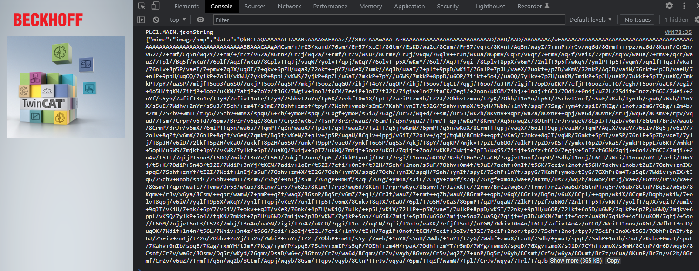

# Transfer TcVnImage via Base64 Encoded Json

## Disclaimer
This is a personal guide not a peer reviewed journal or a sponsored publication. We make
no representations as to accuracy, completeness, correctness, suitability, or validity of any
information and will not be liable for any errors, omissions, or delays in this information or any
losses injuries, or damages arising from its display or use. All information is provided on an as
is basis. It is the reader’s responsibility to verify their own facts.

The views and opinions expressed in this guide are those of the authors and do not
necessarily reflect the official policy or position of any other agency, organization, employer or
company. Assumptions made in the analysis are not reflective of the position of any entity
other than the author(s) and, since we are critically thinking human beings, these views are
always subject to change, revision, and rethinking at any time. Please do not hold us to them
in perpetuity.

## Overview 
This is a simple example showing how to send an image from TwinCAT using a Base64 bit encoded image.  Please note, there are limitations with how big the JSON can be.  Also, this is a proof of concept.  Displaying of images on TcHmi should be handled by the TwinCAT Vision Server Extension.  

## Screenshot

## Getting Started
Place image.png in to your C:\temp folder. Activate and run the PLC project.  Open Main.view in liveview.  You should see the image.  Opening console will show the JSON. 

## Versions
* TcXaeShell 3.1.4024.25
* TE2000 1.12.754.4

## Need more help?
Checkout the other Coding Bytes [here](https://codingbytes.teachable.com/p/codingbytes_twincathmi)
Please visit http://beckhoff.com/ for further guides